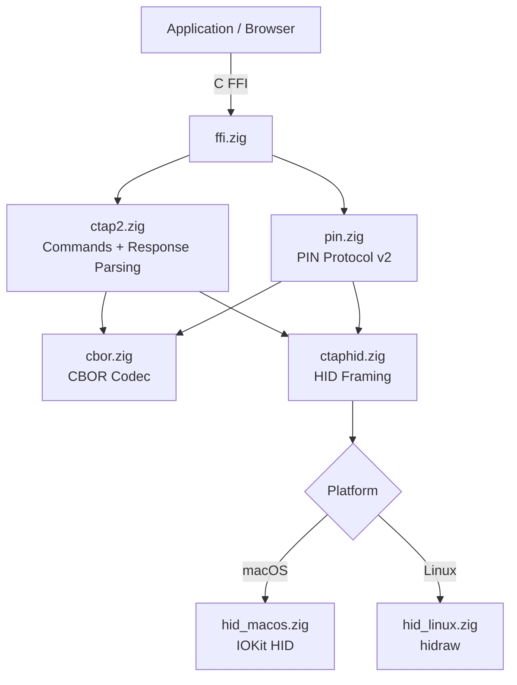
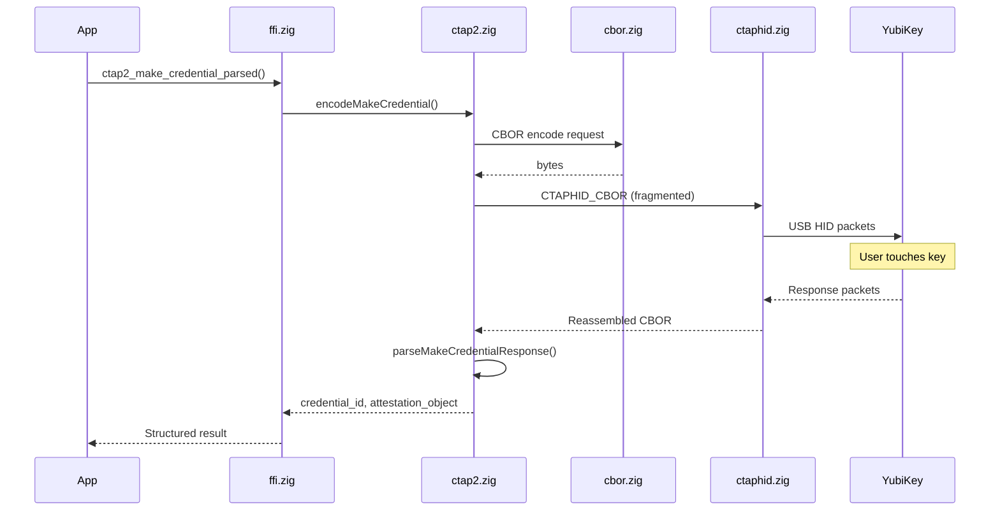
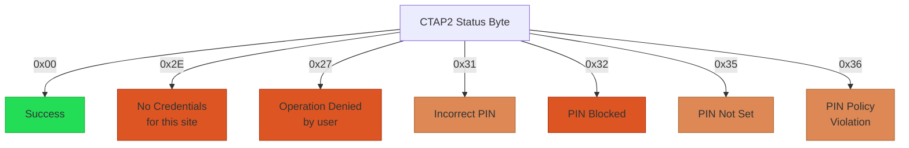

# zig-ctap2

Portable CTAP2/FIDO2 library in Zig — direct USB HID communication with security keys (YubiKey, SoloKeys, etc.), no Apple entitlements or platform authentication frameworks needed.

**License:** Zlib OR MIT

## Why

Apple's `ASAuthorizationController` requires a restricted entitlement + provisioning profile for WebAuthn in general-purpose browsers. This library talks directly to FIDO2 devices over USB HID via IOKit (macOS) and hidraw (Linux), bypassing platform authentication frameworks entirely.

## Features

- **CTAP2 protocol**: makeCredential, getAssertion, getInfo, with structured response parsing
- **PIN protocol v2**: ECDH P-256 key agreement, AES-256-CBC, HMAC-SHA-256 for PIN-authenticated operations
- **CTAPHID framing**: 64-byte packet fragmentation/reassembly, CID management, keepalive handling
- **Minimal CBOR codec**: encoder/decoder for the CTAP2 subset (integers, byte/text strings, arrays, maps, booleans)
- **Platform HID transports**: macOS (IOKit), Linux (hidraw)
- **C FFI**: 16 exported functions callable from Swift, C, C++, or any language with C interop
- **Error mapping**: All CTAP2 status codes mapped to human-readable messages
- **Property-based tests**: 1000-iteration roundtrip tests for CBOR and CTAPHID framing

## Requirements

- Zig 0.15.2+
- macOS 13+ (IOKit) or Linux (hidraw)
- USB security key (tested with YubiKey 5C NFC)

## Build

```bash
# Static library (libctap2.a)
zig build -Doptimize=ReleaseFast

# Run unit tests
zig build test

# Run property-based tests
zig build test-pbt

# Run hardware tests (requires YubiKey connected)
YUBIKEY_TESTS=1 zig build test-hardware
```

With [just](https://just.systems) (recommended):

```bash
just test-all     # unit + PBT tests
just build        # ReleaseFast static library
just info         # show library stats
just              # list all recipes
```

With Nix:

```bash
nix develop       # dev shell (zig, just, detect-secrets, pre-commit)
nix build         # build library package
```

## Architecture



### Registration Flow



### Error Handling



## C API

All functions are blocking (with timeouts) and thread-safe. See [`include/ctap2.h`](include/ctap2.h) for full signatures.

### Core Operations

```c
#include "ctap2.h"

// Enumerate connected FIDO2 devices
int count = ctap2_device_count();

// Register a credential (raw CBOR response)
int bytes = ctap2_make_credential(
    client_data_hash, rp_id, rp_name,
    user_id, user_id_len, user_name, user_display_name,
    alg_ids, alg_count, resident_key,
    result_buf, result_buf_len
);

// Authenticate (raw CBOR response)
int bytes = ctap2_get_assertion(
    client_data_hash, rp_id,
    allow_list_ids, allow_list_id_lens, allow_list_count,
    result_buf, result_buf_len
);

// Get device capabilities
int bytes = ctap2_get_info(result_buf, result_buf_len);
```

### Parsed Responses

These perform the CTAP2 command AND parse the CBOR, returning structured fields:

```c
// Register + parse → credential_id, attestation_object
int status = ctap2_make_credential_parsed(
    client_data_hash, rp_id, rp_name,
    user_id, user_id_len, user_name, user_display_name,
    alg_ids, alg_count, resident_key,
    out_credential_id, &out_credential_id_len,
    out_attestation_object, &out_attestation_object_len
);

// Authenticate + parse → credential_id, auth_data, signature, user_handle
int status = ctap2_get_assertion_parsed(
    client_data_hash, rp_id,
    allow_list_ids, allow_list_id_lens, allow_list_count,
    out_credential_id, &out_credential_id_len,
    out_auth_data, &out_auth_data_len,
    out_signature, &out_signature_len,
    out_user_handle, &out_user_handle_len
);
```

### Pure Parsing (no I/O)

Parse raw CTAP2 response bytes you already have:

```c
ctap2_parse_make_credential_response(response, len, ...);
ctap2_parse_get_assertion_response(response, len, fallback_cred, ...);
```

### PIN Protocol

```c
// Check remaining PIN retries
int retries;
ctap2_get_pin_retries(&retries);

// Get PIN token (ECDH + AES-256-CBC handshake)
uint8_t pin_token[32];
ctap2_get_pin_token("123456", pin_token, 32);

// PIN-authenticated registration
ctap2_make_credential_with_pin(
    client_data_hash, rp_id, rp_name, ...,
    pin_token, 2,  // pin_protocol = 2
    out_credential_id, &out_credential_id_len,
    out_attestation_object, &out_attestation_object_len
);

// PIN-authenticated assertion
ctap2_get_assertion_with_pin(
    client_data_hash, rp_id, ...,
    pin_token, 2,
    out_credential_id, &out_credential_id_len, ...
);
```

### Utilities

```c
// Human-readable error messages
const char *msg = ctap2_status_message(0x35);
// → "PIN not set - configure a PIN on your security key first"

// Debug: last IOKit return code
int ioret = ctap2_debug_last_ioreturn();
```

### Status Codes

| Code | Meaning |
|------|---------|
| `CTAP2_OK` (0) | Success |
| `CTAP2_ERR_NO_DEVICE` (-1) | No FIDO2 device connected |
| `CTAP2_ERR_TIMEOUT` (-2) | Device communication timeout |
| `CTAP2_ERR_PROTOCOL` (-3) | CTAPHID protocol error |
| `CTAP2_ERR_BUFFER_TOO_SMALL` (-4) | Output buffer too small |
| `CTAP2_ERR_OPEN_FAILED` (-5) | Failed to open HID device |
| `CTAP2_ERR_WRITE_FAILED` (-6) | USB write failed |
| `CTAP2_ERR_READ_FAILED` (-7) | USB read failed |
| `CTAP2_ERR_CBOR` (-8) | CBOR encoding/decoding error |
| `CTAP2_ERR_DEVICE` (-9) | CTAP2 device error (check status byte) |
| `CTAP2_ERR_PIN` (-10) | PIN protocol error |

## Entitlements

On macOS with hardened runtime, add to your entitlements:

```xml
<key>com.apple.security.device.usb</key>
<true/>
```

The user must grant **Input Monitoring** permission in System Settings > Privacy & Security.

No other entitlements needed — no `com.apple.developer.web-browser.public-key-credential`, no provisioning profile, no Apple Developer portal configuration.

## Integration with cmux

This library powers the FIDO2/WebAuthn support in [cmux](https://github.com/Jesssullivan/cmux) (fork), integrated as a git submodule at `vendor/ctap2`. The JS bridge in WKWebView intercepts `navigator.credentials.create/get` and routes to libctap2 via Swift C FFI.

## Tested Devices

- YubiKey 5C NFC (USB, firmware 5.x)

## Status

- [x] makeCredential (registration)
- [x] getAssertion (authentication)
- [x] getInfo (device capabilities)
- [x] CBOR response parsing (structured result types)
- [x] CTAP2 error code mapping (human-readable messages)
- [x] PIN protocol v2 (ECDH P-256, AES-256-CBC, HMAC-SHA-256)
- [x] Property-based tests (CBOR + CTAPHID, 1000 iterations each)
- [x] Hardware integration tests (YubiKey roundtrips)
- [ ] Extensions (credProtect, hmac-secret)
- [ ] NFC transport

## License

Dual-licensed under [Zlib](https://opensource.org/licenses/Zlib) and [MIT](https://opensource.org/licenses/MIT). Choose whichever you prefer.
