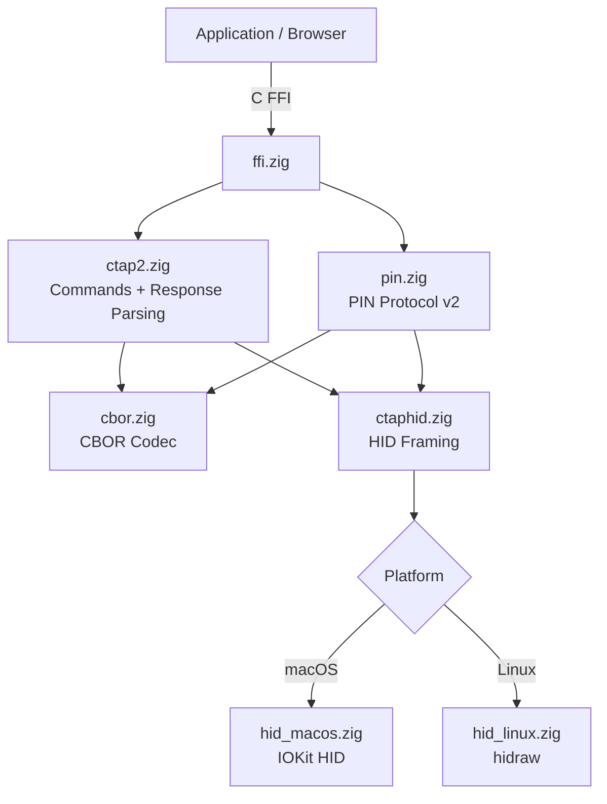
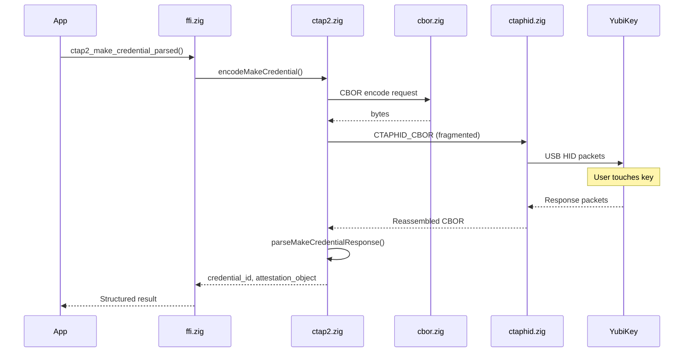
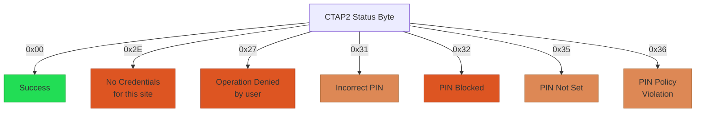

# zig-ctap2

Portable CTAP2/FIDO2 USB HID library in Zig with a stable C ABI for native applications on macOS and Linux.

**License:** Zlib OR MIT

**Docs:** https://transscendsurvival.org/zig-ctap2/

## Why

Apple applications commonly reach passkeys and platform authenticators through AuthenticationServices (`ASAuthorizationController`, authorization providers, and app/browser entitlements). Linux-native applications commonly need a lower-level path to USB security keys through hidraw.

zig-ctap2 provides a small, stable FFI boundary for CTAP2 over USB HID: device enumeration, makeCredential, getAssertion, getInfo, PIN protocol v2, keepalive callbacks, and raw-response parsing. It is useful when a native app needs portable external-authenticator operations without binding all credential logic to one OS application framework.

It does not replace SwiftUI, AppKit, UIKit, Cocoa, AuthenticationServices UI, passkeys/iCloud Keychain, platform authenticators, browser WebAuthn policy, Secure Enclave, LocalAuthentication, biometric prompts, attestation policy validation, origin/RP policy, account sync, or application UI lifecycle.

## Features

- **CTAP2 protocol**: makeCredential, getAssertion, getInfo, with structured response parsing
- **PIN protocol v2**: ECDH P-256 key agreement, AES-256-CBC, HMAC-SHA-256 for PIN-authenticated operations
- **CTAPHID framing**: 64-byte packet fragmentation/reassembly, CID management, keepalive handling
- **Minimal CBOR codec**: encoder/decoder for the CTAP2 subset (integers, byte/text strings, arrays, maps, booleans)
- **Platform HID transports**: macOS (IOKit), Linux (hidraw)
- **C FFI**: 16 exported functions callable from Swift, C, C++, or any language with C interop
- **Zig package API**: Direct Zig imports use `src/root.zig`; C ABI exports stay in `src/ffi.zig`
- **Error mapping**: All CTAP2 status codes mapped to human-readable messages
- **Property-based tests**: 1000-iteration roundtrip tests for CBOR and CTAPHID framing

## Requirements

- Zig 0.15.2+
- macOS 13+ (IOKit) or Linux (hidraw)
- USB security key (tested with YubiKey 5C NFC)

## Installation

### Zig Package Manager (recommended)

```bash
zig fetch --save git+https://github.com/Jesssullivan/zig-ctap2.git
```

Then in your `build.zig`:

```zig
const dep = b.dependency("zig_ctap2", .{ .target = target, .optimize = optimize });
exe.root_module.addImport("zig-ctap2", dep.module("zig-ctap2"));
```

### Git Submodule (C FFI consumers)

```bash
git submodule add https://github.com/Jesssullivan/zig-ctap2.git vendor/ctap2
cd vendor/ctap2 && zig build -Doptimize=ReleaseFast
```

Link `-lctap2` and include `ctap2.h`. At final link time, add platform frameworks:
- **macOS:** `-framework IOKit -framework CoreFoundation`
- **Linux:** no extra libraries needed (uses hidraw via kernel)

## Build

```bash
# Static library (libctap2.a)
zig build -Doptimize=ReleaseFast

# Run unit tests
zig build test

# Run property-based tests
zig build test-pbt

# Run hardware tests (requires YubiKey connected)
YUBIKEY_TESTS=1 zig build test-hardware

# Build C example
zig build example
```

With [just](https://just.systems) (recommended):

```bash
just test-all     # unit + PBT tests
just build        # ReleaseFast static library
just info         # show library stats
just              # list all recipes
```

With Nix:

```bash
nix develop       # dev shell with Zig 0.15.2
```

## Architecture


```mermaid
graph TD
    A[Application / Browser] -->|C FFI| B[ffi.zig]
    B --> C[ctap2.zig<br/>Commands + Response Parsing]
    B --> D[pin.zig<br/>PIN Protocol v2]
    C --> E[cbor.zig<br/>CBOR Codec]
    D --> E
    C --> F[ctaphid.zig<br/>HID Framing]
    D --> F
    F --> G{Platform}
    G -->|macOS| H[hid_macos.zig<br/>IOKit HID]
    G -->|Linux| I[hid_linux.zig<br/>hidraw]
```

### Registration Flow


```mermaid
sequenceDiagram
    participant App
    participant FFI as ffi.zig
    participant CTAP as ctap2.zig
    participant CBOR as cbor.zig
    participant HID as ctaphid.zig
    participant Key as YubiKey

    App->>FFI: ctap2_make_credential_parsed()
    FFI->>CTAP: encodeMakeCredential()
    CTAP->>CBOR: CBOR encode request
    CBOR-->>CTAP: bytes
    CTAP->>HID: CTAPHID_CBOR (fragmented)
    HID->>Key: USB HID packets
    Note over Key: User touches key
    Key-->>HID: Response packets
    HID-->>CTAP: Reassembled CBOR
    CTAP->>CTAP: parseMakeCredentialResponse()
    CTAP-->>FFI: credential_id, attestation_object
    FFI-->>App: Structured result
```

### Error Handling


```mermaid
graph TD
    E[CTAP2 Status Byte] -->|0x00| OK[Success]
    E -->|0x2E| NC[No Credentials<br/>for this site]
    E -->|0x27| OD[Operation Denied<br/>by user]
    E -->|0x31| IP[Incorrect PIN]
    E -->|0x32| PB[PIN Blocked]
    E -->|0x35| PNS[PIN Not Set]
    E -->|0x36| PV[PIN Policy<br/>Violation]

    style OK fill:#2d5,stroke:#1a3
    style NC fill:#d52,stroke:#a31
    style OD fill:#d52,stroke:#a31
    style IP fill:#d85,stroke:#a63
    style PB fill:#d52,stroke:#a31
    style PNS fill:#d85,stroke:#a63
    style PV fill:#d85,stroke:#a63
```

## C API

All functions are blocking (with timeouts) and thread-safe. See [`include/ctap2.h`](include/ctap2.h) for full signatures.

### Core Operations

```c
#include "ctap2.h"

// Enumerate connected FIDO2 devices
int count = ctap2_device_count();

// Register a credential (raw CBOR response)
int bytes = ctap2_make_credential(
    client_data_hash, rp_id, rp_name,
    user_id, user_id_len, user_name, user_display_name,
    alg_ids, alg_count, resident_key,
    result_buf, result_buf_len
);

// Authenticate (raw CBOR response)
int bytes = ctap2_get_assertion(
    client_data_hash, rp_id,
    allow_list_ids, allow_list_id_lens, allow_list_count,
    result_buf, result_buf_len
);

// Get device capabilities
int bytes = ctap2_get_info(result_buf, result_buf_len);
```

### Parsed Responses

These perform the CTAP2 command AND parse the CBOR, returning structured fields:

```c
// Register + parse → credential_id, attestation_object
int status = ctap2_make_credential_parsed(
    client_data_hash, rp_id, rp_name,
    user_id, user_id_len, user_name, user_display_name,
    alg_ids, alg_count, resident_key,
    out_credential_id, &out_credential_id_len,
    out_attestation_object, &out_attestation_object_len
);

// Authenticate + parse → credential_id, auth_data, signature, user_handle
int status = ctap2_get_assertion_parsed(
    client_data_hash, rp_id,
    allow_list_ids, allow_list_id_lens, allow_list_count,
    out_credential_id, &out_credential_id_len,
    out_auth_data, &out_auth_data_len,
    out_signature, &out_signature_len,
    out_user_handle, &out_user_handle_len
);
```

### Pure Parsing (no I/O)

Parse raw CTAP2 response bytes you already have:

```c
ctap2_parse_make_credential_response(response, len, ...);
ctap2_parse_get_assertion_response(response, len, fallback_cred, ...);
```

### PIN Protocol

```c
// Check remaining PIN retries
int retries;
ctap2_get_pin_retries(&retries);

// Get PIN token (ECDH + AES-256-CBC handshake)
uint8_t pin_token[32];
ctap2_get_pin_token("123456", pin_token, 32);

// PIN-authenticated registration
ctap2_make_credential_with_pin(
    client_data_hash, rp_id, rp_name, ...,
    pin_token, 2,  // pin_protocol = 2
    out_credential_id, &out_credential_id_len,
    out_attestation_object, &out_attestation_object_len
);

// PIN-authenticated assertion
ctap2_get_assertion_with_pin(
    client_data_hash, rp_id, ...,
    pin_token, 2,
    out_credential_id, &out_credential_id_len, ...
);
```

### Utilities

```c
// Human-readable error messages
const char *msg = ctap2_status_message(0x35);
// → "PIN not set - configure a PIN on your security key first"

// Debug: last IOKit return code
int ioret = ctap2_debug_last_ioreturn();
```

### Status Codes

| Code | Meaning |
|------|---------|
| `CTAP2_OK` (0) | Success |
| `CTAP2_ERR_NO_DEVICE` (-1) | No FIDO2 device connected |
| `CTAP2_ERR_TIMEOUT` (-2) | Device communication timeout |
| `CTAP2_ERR_PROTOCOL` (-3) | CTAPHID protocol error |
| `CTAP2_ERR_BUFFER_TOO_SMALL` (-4) | Output buffer too small |
| `CTAP2_ERR_OPEN_FAILED` (-5) | Failed to open HID device |
| `CTAP2_ERR_WRITE_FAILED` (-6) | USB write failed |
| `CTAP2_ERR_READ_FAILED` (-7) | USB read failed |
| `CTAP2_ERR_CBOR` (-8) | CBOR encoding/decoding error |
| `CTAP2_ERR_DEVICE` (-9) | CTAP2 device error (check status byte) |
| `CTAP2_ERR_PIN` (-10) | PIN protocol error |

## Apple / Swift / Objective-C Interop

zig-ctap2 parallels only the USB HID CTAP2 portion of an Apple authenticator flow. The Apple analogs are `ASAuthorizationController` and WebAuthn/passkey APIs at the application layer, plus IOKit HID at the transport layer. This library implements the transport/protocol side, not the Apple UI, passkey, account, entitlement, or browser policy side.

Current parity:

- Available: C ABI callable from Swift, Objective-C, C, C++, and other FFI hosts.
- Available: macOS USB HID transport through IOKit and CoreFoundation.
- Available: Linux USB HID transport through hidraw.
- Available: makeCredential, getAssertion, getInfo, CTAPHID framing, CTAP2 response parsing, PIN protocol v2, and keepalive callback variants.
- Not yet available: SwiftPM/modulemap packaging, ObjC nullability annotations, dedicated Swift wrapper types, ObjC sample app, WebAuthn request/response helper types, attestation statement validation, origin/RP policy checks, browser mediation semantics, platform authenticators, passkeys/iCloud Keychain, Secure Enclave, LocalAuthentication, biometric prompts, NFC, BLE, or CTAP extensions such as hmac-secret/credProtect.

Good starter contributions should focus on those interop and documentation gaps before expanding the ABI.

## macOS USB Permissions

On macOS with hardened runtime, add to your entitlements:

```xml
<key>com.apple.security.device.usb</key>
<true/>
```

The user must grant **Input Monitoring** permission in System Settings > Privacy & Security.

zig-ctap2 does not use `com.apple.developer.web-browser.public-key-credential` because it does not call AuthenticationServices WebAuthn/passkey UI. Applications still need the USB entitlement above when hardened runtime policies apply, and they remain responsible for their own WebAuthn, RP, origin, attestation, and UX policy.

## Contributing

Start with the [`good first issue`](https://github.com/Jesssullivan/zig-ctap2/labels/good%20first%20issue) and [`help wanted`](https://github.com/Jesssullivan/zig-ctap2/labels/help%20wanted) queues. The best early contributions are small Swift/ObjC interop examples, documentation truthing, header annotations, WebAuthn mapping examples, and build/package smoke tests.

## Tested Devices

- YubiKey 5C NFC (USB, firmware 5.x)

## Status

- [x] makeCredential (registration)
- [x] getAssertion (authentication)
- [x] getInfo (device capabilities)
- [x] CBOR response parsing (structured result types)
- [x] CTAP2 error code mapping (human-readable messages)
- [x] PIN protocol v2 (ECDH P-256, AES-256-CBC, HMAC-SHA-256)
- [x] Property-based tests (CBOR + CTAPHID, 1000 iterations each)
- [x] Hardware integration tests (YubiKey roundtrips)
- [ ] Extensions (credProtect, hmac-secret)
- [ ] NFC transport

## License

Dual-licensed under [Zlib](https://opensource.org/licenses/Zlib) and [MIT](https://opensource.org/licenses/MIT). Choose whichever you prefer.
