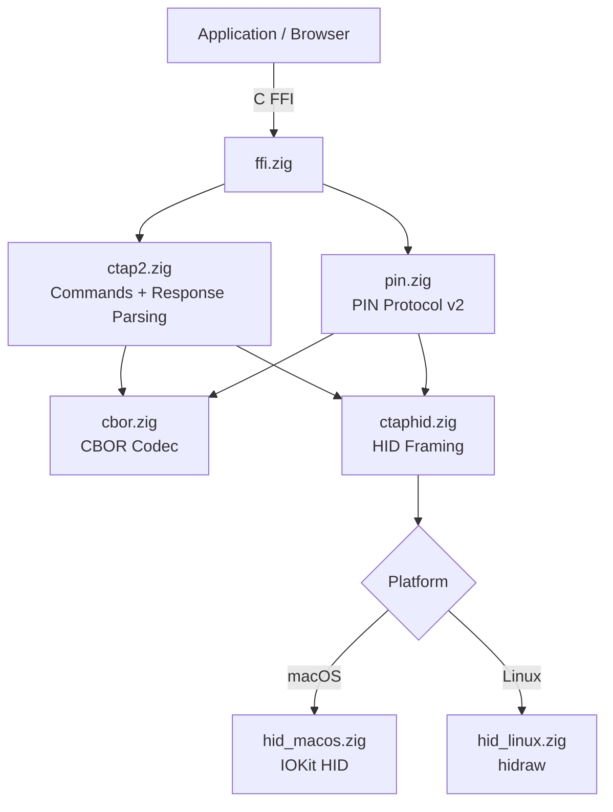
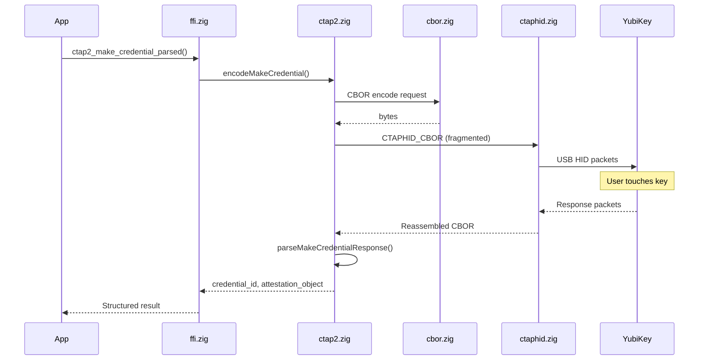

# zig-ctap2

Portable CTAP2/FIDO2 library in Zig -- direct USB HID communication with security keys (YubiKey, SoloKeys, etc.), no Apple entitlements or platform authentication frameworks needed.

**License:** Zlib OR MIT

## Why

Apple's `ASAuthorizationController` requires a restricted entitlement + provisioning profile for WebAuthn in general-purpose browsers. This library talks directly to FIDO2 devices over USB HID via IOKit (macOS) and hidraw (Linux), bypassing platform authentication frameworks entirely.

## Features

- **CTAP2 protocol**: makeCredential, getAssertion, getInfo, with structured response parsing
- **PIN protocol v2**: ECDH P-256 key agreement, AES-256-CBC, HMAC-SHA-256 for PIN-authenticated operations
- **CTAPHID framing**: 64-byte packet fragmentation/reassembly, CID management, keepalive handling
- **Minimal CBOR codec**: encoder/decoder for the CTAP2 subset (integers, byte/text strings, arrays, maps, booleans)
- **Platform HID transports**: macOS (IOKit), Linux (hidraw)
- **C FFI**: 16+ exported functions callable from Swift, C, C++, or any language with C interop
- **Error mapping**: All CTAP2 status codes mapped to human-readable messages
- **Property-based tests**: 1000-iteration roundtrip tests for CBOR and CTAPHID framing

## Quick Start

```bash
# Build static library (libctap2.a)
zig build -Doptimize=ReleaseFast

# Run unit tests
zig build test

# Run property-based tests
zig build test-pbt
```

## Architecture



## Registration Flow



## Source Tree

```
zig-ctap2/
  build.zig          -- Build configuration
  include/
    ctap2.h          -- C header (public API)
  src/
    ffi.zig          -- C FFI exports
    ctap2.zig        -- CTAP2 command encoding + response parsing
    cbor.zig         -- Minimal CBOR codec
    ctaphid.zig      -- CTAPHID framing (64-byte packets)
    hid.zig          -- Platform HID abstraction
    hid_macos.zig    -- IOKit HID transport
    hid_linux.zig    -- hidraw transport
    pin.zig          -- PIN protocol v2
  tests/
    pbt_cbor.zig     -- CBOR property-based tests
    pbt_ctaphid.zig  -- CTAPHID property-based tests
```

## Requirements

- Zig 0.15.2+
- macOS 13+ (IOKit) or Linux (hidraw)
- USB security key (tested with YubiKey 5C NFC)

## Status

- [x] makeCredential (registration)
- [x] getAssertion (authentication)
- [x] getInfo (device capabilities)
- [x] CBOR response parsing (structured result types)
- [x] CTAP2 error code mapping (human-readable messages)
- [x] PIN protocol v2 (ECDH P-256, AES-256-CBC, HMAC-SHA-256)
- [x] Property-based tests (CBOR + CTAPHID, 1000 iterations each)
- [x] Hardware integration tests (YubiKey roundtrips)
- [ ] Extensions (credProtect, hmac-secret)
- [ ] NFC transport
