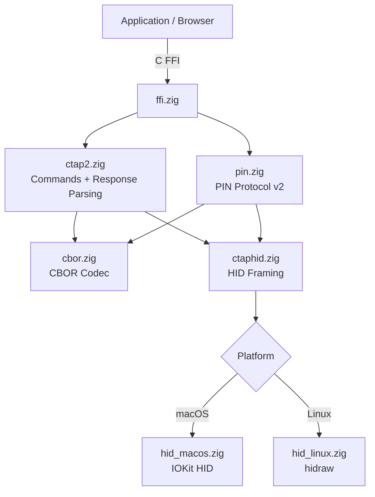
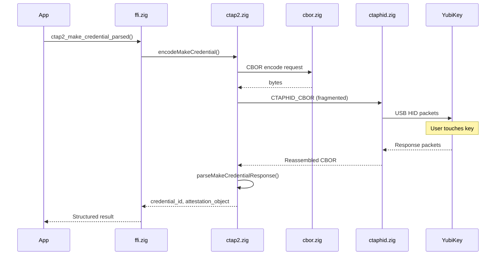

# zig-ctap2

Portable CTAP2/FIDO2 USB HID library in Zig with a stable C ABI for native applications on macOS and Linux.

**License:** Zlib OR MIT

## Why

zig-ctap2 provides a small FFI boundary for CTAP2 over USB HID: device enumeration, makeCredential, getAssertion, getInfo, PIN protocol v2, keepalive callbacks, and raw-response parsing. It is useful when a native app needs portable external-authenticator operations without binding all credential logic to one OS application framework.

It does not replace SwiftUI, AppKit, UIKit, Cocoa, AuthenticationServices UI, passkeys/iCloud Keychain, platform authenticators, browser WebAuthn policy, Secure Enclave, LocalAuthentication, biometric prompts, attestation policy validation, origin/RP policy, account sync, or application UI lifecycle.

## Features

- **CTAP2 protocol**: makeCredential, getAssertion, getInfo, with structured response parsing
- **PIN protocol v2**: ECDH P-256 key agreement, AES-256-CBC, HMAC-SHA-256 for PIN-authenticated operations
- **CTAPHID framing**: 64-byte packet fragmentation/reassembly, CID management, keepalive handling
- **Minimal CBOR codec**: encoder/decoder for the CTAP2 subset (integers, byte/text strings, arrays, maps, booleans)
- **Platform HID transports**: macOS (IOKit), Linux (hidraw)
- **C FFI**: 16 exported functions callable from Swift, C, C++, or any language with C interop
- **Zig package API**: Direct Zig imports use `src/root.zig`; C ABI exports stay in `src/ffi.zig`
- **Error mapping**: All CTAP2 status codes mapped to human-readable messages
- **Property-based tests**: 1000-iteration roundtrip tests for CBOR and CTAPHID framing

## Quick Start

```bash
# Build static library (libctap2.a)
zig build -Doptimize=ReleaseFast

# Run unit tests
zig build test

# Run property-based tests
zig build test-pbt

# Build C example
zig build example
```

## Architecture


```mermaid
graph TD
    A[Application / Browser] -->|C FFI| B[ffi.zig]
    B --> C[ctap2.zig<br/>Commands + Response Parsing]
    B --> D[pin.zig<br/>PIN Protocol v2]
    C --> E[cbor.zig<br/>CBOR Codec]
    D --> E
    C --> F[ctaphid.zig<br/>HID Framing]
    D --> F
    F --> G{Platform}
    G -->|macOS| H[hid_macos.zig<br/>IOKit HID]
    G -->|Linux| I[hid_linux.zig<br/>hidraw]
```

## Registration Flow


```mermaid
sequenceDiagram
    participant App
    participant FFI as ffi.zig
    participant CTAP as ctap2.zig
    participant CBOR as cbor.zig
    participant HID as ctaphid.zig
    participant Key as YubiKey

    App->>FFI: ctap2_make_credential_parsed()
    FFI->>CTAP: encodeMakeCredential()
    CTAP->>CBOR: CBOR encode request
    CBOR-->>CTAP: bytes
    CTAP->>HID: CTAPHID_CBOR (fragmented)
    HID->>Key: USB HID packets
    Note over Key: User touches key
    Key-->>HID: Response packets
    HID-->>CTAP: Reassembled CBOR
    CTAP->>CTAP: parseMakeCredentialResponse()
    CTAP-->>FFI: credential_id, attestation_object
    FFI-->>App: Structured result
```

## Source Tree

```
zig-ctap2/
  build.zig          -- Build configuration
  include/
    ctap2.h          -- C header (public API)
  src/
    root.zig         -- Zig package API root
    ffi.zig          -- C FFI exports
    ctap2.zig        -- CTAP2 command encoding + response parsing
    cbor.zig         -- Minimal CBOR codec
    ctaphid.zig      -- CTAPHID framing (64-byte packets)
    hid.zig          -- Platform HID abstraction
    hid_macos.zig    -- IOKit HID transport
    hid_linux.zig    -- hidraw transport
    pin.zig          -- PIN protocol v2
  tests/
    pbt_cbor.zig     -- CBOR property-based tests
    pbt_ctaphid.zig  -- CTAPHID property-based tests
```

## Requirements

- Zig 0.15.2+
- macOS 13+ (IOKit) or Linux (hidraw)
- USB security key (tested with YubiKey 5C NFC)

## Apple Interop Scope

zig-ctap2 parallels only the USB HID CTAP2 portion of an Apple authenticator flow. It does not replace AuthenticationServices UI, passkeys/iCloud Keychain, platform authenticators, browser mediation, Secure Enclave, LocalAuthentication, biometric prompts, or WebAuthn RP/origin policy.

See [Apple Interop](guides/apple-interop.md) for Swift/Objective-C status and current parity gaps.

## Status

- [x] makeCredential (registration)
- [x] getAssertion (authentication)
- [x] getInfo (device capabilities)
- [x] CBOR response parsing (structured result types)
- [x] CTAP2 error code mapping (human-readable messages)
- [x] PIN protocol v2 (ECDH P-256, AES-256-CBC, HMAC-SHA-256)
- [x] Property-based tests (CBOR + CTAPHID, 1000 iterations each)
- [x] Hardware integration tests (YubiKey roundtrips)
- [ ] Extensions (credProtect, hmac-secret)
- [ ] NFC transport
